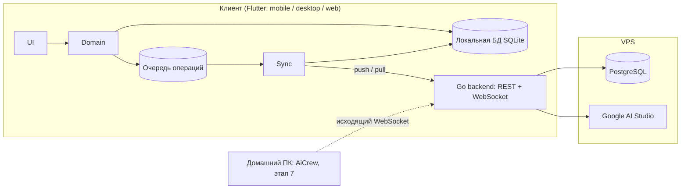

# Архитектура PromptTree (этап 3)

Статус: **согласовано** (08.10.2026). Основа: ТЗ v4, [P0](P0-decisions.md), [дизайн](../design/DECISIONS.md).

Документ покрывает только PromptTree: дерево, контент, версии, синхронизацию, авторизацию. AI Structuring Engine (этап 6) и AiCrew (этап 7) здесь только резервируют место в схеме.

## 1. Общая картина

Правило: интерфейс читает и пишет **только локальную БД**. Сеть — забота модуля синхронизации, интерфейс о ней не знает. Поэтому приложение одинаково работает онлайн и офлайн.

## 2. Клиент

### 2.1 Пакеты

| Пакет | Что внутри |
|---|---|
| `shared/core` | ошибки, логирование, генерация UUIDv7, часы, DI |
| `shared/models` | неизменяемые модели (`freezed`) |
| `shared/domain` | сценарии (создать заметку, переместить, структурировать, откатить версию) и интерфейсы хранилищ |
| `shared/data` | реализация `LocalStorage` на Drift |
| `shared/sync` | очередь операций, push/pull, перебазирование, разрешение конфликтов |
| `shared/api` | HTTP- и WebSocket-клиент, авторизация |
| `app-mobile`, `app-desktop`, `web` | только экраны, навигация и платформенные реализации, подключаемые через DI |

Управление состоянием: **Riverpod**. Платформенные различия (буфер обмена, хранилище токенов, путь к БД) — отдельные реализации интерфейсов из `core`, без `if (Platform...)` в коде экранов.

### 2.2 Локальная БД: абстракция `LocalStorage`

- `LocalStorage` — набор интерфейсов в `domain`: `NodeStore`, `ContentStore`, `VersionStore`, `OutboxStore`, `SyncStateStore`, плюс `transaction(fn)`. Сценарии зависят только от них.
- Реализация: **Drift (SQLite)** — одна кодовая база на всех платформах:
  - Android, iOS, Windows, macOS, Linux — нативный SQLite, режим WAL;
  - Web — SQLite в WebAssembly. Хранение в OPFS, если браузер поддерживает, иначе IndexedDB. Несколько вкладок работают с одной БД через общий воркер.
- Миграции схемы — версионированные шаги Drift, каждая миграция покрыта тестом (ТЗ п. 16).
- Почему не Isar/Hive: нет транзакций уровня SQL или слабая поддержка веба; для журнала операций нужны атомарные транзакции «изменение + запись в очередь».

### 2.3 Защита от потери ввода

- Текст сохраняется в локальную БД через 300 мс после остановки набора и сразу при сворачивании, закрытии окна или уходе со страницы. При падении приложения теряется не больше 300 мс ввода.
- Изменение данных и запись операции в очередь — одна транзакция: не бывает состояния «сохранено, но не уйдёт на сервер».
- Ctrl+Z — стек редактора в памяти, к БД не относится. История версий — отдельно (п. 3.4).

## 3. Модель данных

Идентификаторы — **UUIDv7, создаются на клиенте**: узел можно создать офлайн, и его id не поменяется после синхронизации.

Схемы PostgreSQL разделены по доменам (ТЗ п. 5.4): `core` — пользователи и доступ, `tree` — PromptTree, `ai` — структурирование, `exec` — зарезервирована под AiCrew.

### 3.1 `core`

| Таблица | Поля |
|---|---|
| `users` | id, email, name, created_at |
| `devices` | id (= `client_id`), user_id, name, platform, last_seen_at, revoked_at |
| `sessions` | id, device_id, refresh_token_hash, expires_at, rotated_from |
| `project_access` | project_id, user_id, role (`owner` / `editor` / `viewer` / `executor`) |

### 3.2 `tree`

| Таблица | Поля |
|---|---|
| `projects` | id, name, description, revision, deleted_at, created_at |
| `repositories` | id, project_id, provider, remote_url, default_branch, description, revision. Привязка к локальному пути на хосте — в `exec`, этап 7 |
| `nodes` | id, project_id, parent_id (null = корень проекта), kind (`folder` / `raw_note` / `ai_task`), name, sort_key, revision, deleted_at, created_at |
| `node_content` | node_id, raw_content, raw_revision, structured_content (jsonb), structured_revision, structured_from_revision, structure_status |
| `content_versions` | id, node_id, field (`raw` / `structured`), content, at_revision, reason, device_id, created_at |
| `operations` | operation_id (PK), user_id, device_id, client_seq, type, payload, base_revision, server_revision, result (`applied` / `conflict` / `rejected`), created_at |
| `audit_events` | id, entity, entity_id, action, before, after, operation_id, server_revision, created_at |

Пояснения:
- `sort_key` — дробный строковый ключ порядка (как LexoRank). Вставка между соседями не перенумеровывает остальных, поэтому одновременные перестановки с двух устройств не конфликтуют.
- `revision` у каждой сущности — это `server_revision` последней применённой к ней операции.
- `structured_content` хранится блоками; у каждого блока метка `origin: ai | human`. Блоки, правленные человеком, повторное структурирование не перезаписывает (ТЗ п. 6.1). Подробно — на этапе 6.
- Удаление мягкое: `deleted_at`. Корзина видна в интерфейсе, окончательное удаление — только вручную.

### 3.3 `ai` (резерв под этап 6)

`structure_requests`: request_id, node_id, source_revision, source_content_hash, prompt_version, model, generated (jsonb), status, error, created_at, completed_at. Логика транзакционности (ТЗ п. 6.2) проектируется на этапе 6.

### 3.4 Когда создаётся версия контента

Версия в `content_versions` пишется не на каждую операцию, а в моменты, к которым имеет смысл откатываться:
- перед структурированием (`before_structure`);
- при конфликте — обе стороны (`conflict_local`, `conflict_server`);
- перед откатом к старой версии (`before_restore`);
- после паузы в редактировании больше 5 минут (`checkpoint`).

## 4. Протокол синхронизации

### 4.1 Операции

Клиент не отправляет «состояние объекта», он отправляет операции:

`create_project`, `update_project`, `create_node`, `rename_node`, `move_node` (parent_id + sort_key), `change_kind`, `delete_node`, `restore_node`, `set_raw_content`, `set_structured_block`, `restore_version`, `resolve_conflict`.

Каждая операция: `operation_id`, `client_id`, `client_seq`, `type`, `entity_id`, `base_revision` (какую ревизию объекта видел клиент), `payload`.

Набор текста не превращается в поток операций: пока операция `set_raw_content` по узлу ещё не отправлена, новые правки заменяют её payload. Её `base_revision` остаётся прежним.

### 4.2 Обмен

| Канал | Назначение |
|---|---|
| `POST /sync/push` | пакет операций. Сервер обрабатывает их по порядку `client_seq`, на каждую отвечает `applied` + `server_revision`, `conflict` + текущее состояние или `rejected` + причина |
| `GET /sync/pull?cursor=N` | все изменения с `server_revision > N` по доступным проектам, постранично |
| `WS /ws` | сервер сообщает «есть ревизия N» (клиент делает pull) и результаты структурирования. Данные по WebSocket не ходят: источник истины — pull, поэтому пропущенное уведомление ничего не ломает |

- **Идемпотентность:** `operation_id` — первичный ключ. Повтор той же операции возвращает сохранённый результат и ничего не применяет второй раз.
- **Порядок:** `server_revision` — сквозной счётчик PostgreSQL (sequence), выдаётся внутри транзакции применения. Часы устройств на порядок не влияют, `updated_at` только для отображения.

### 4.3 Правила конфликтов

Проверка — на уровне поля: конфликт возникает, только если с `base_revision` клиента изменилось **то же самое поле**.

| Что меняли одновременно | Что делает сервер |
|---|---|
| Разные поля (имя и текст, текст и родитель) | Применяет обе операции, конфликта нет |
| Текст (`raw_content`) | `conflict`. Обе версии сохраняются в `content_versions`, узел получает пометку «конфликт», пользователь выбирает версию или сливает вручную (`resolve_conflict`). Ничего не теряется |
| Блок `structured_content` | То же, что для текста, но по блоку |
| Имя, тип | Применяется операция, пришедшая на сервер позже. Проигравшее значение пишется в `audit_events`, клиент показывает уведомление «имя изменено на другом устройстве» |
| Перемещение | Применяется; если создаёт цикл или родитель удалён — `rejected`, узел остаётся на месте |
| Правка удалённого узла | Узел восстанавливается и правка применяется: удаление не должно съедать текст |
| Создание или перемещение в удалённую папку | Папка (и её удалённые предки) восстанавливается, узел создаётся или перемещается |
| Повторная правка текста с того же устройства до получения ответа | Не конфликт: конфликтом считается только изменение с другого устройства |

Автоматического слияния непересекающихся правок текста в MVP нет: при конфликте текста пользователь всегда видит обе версии (см. вопрос 1 ниже).

### 4.4 Клиент: оптимистичное применение и перебазирование

1. Операция сразу применяется к локальной БД и попадает в очередь (одна транзакция).
2. Синхронизатор отправляет очередь пакетами по 100; при ошибке сети — повтор с экспоненциальной задержкой до 60 с.
3. Ответ `applied` — операция удаляется из очереди, локальная ревизия обновляется.
4. Ответ `conflict` / `rejected`, а также новые данные из pull — клиент берёт серверное состояние объекта и заново применяет поверх него ещё не подтверждённые операции. Интерфейс всегда показывает «сервер + мои неотправленные правки».
5. Курсор `cursor` хранится в `SyncStateStore` и сдвигается только после успешной записи данных pull в локальную БД.

## 5. Авторизация и доступ

- Вход: email + пароль (хэш Argon2id). Сторонние провайдеры входа в MVP не нужны.
- Access JWT живёт 15 минут, refresh-токен — 60 дней, ротируется при каждом использовании и привязан к устройству. Повторное использование старого refresh-токена отзывает сессию устройства.
- Офлайн приложение работает без токена; синхронизация возобновляется после обновления токена.
- Каждый обработчик проверяет `project_access`. В MVP у всех проектов одна запись `owner`, но проверка есть с первого дня.
- Токены на клиенте: Keychain / Keystore / Credential Manager; в вебе refresh-токен в httpOnly cookie.

## 6. Backend (Go)

- Модули: `core` (auth), `tree` (операции, pull), `ai` (этап 6), `exec` (этап 7), общий `platform` (БД, логи, конфиг). Модули общаются через интерфейсы, домены не лезут в чужие таблицы.
- Применение операции — одна транзакция PostgreSQL: блокировка строки объекта, проверка `base_revision`, запись данных, запись в `operations` и `audit_events`, выдача `server_revision`.
- Миграции SQL версионируются в репозитории (`goose`), применяются при деплое.
- Импорт из GitHub (только метаданные, только чтение) — отдельный обработчик, токен GitHub хранится на сервере.

## 7. Эксплуатация VPS

- Docker Compose: backend, PostgreSQL, Caddy (HTTPS, раздача Flutter Web с заголовками для OPFS).
- Резервные копии: ежедневный `pg_dump`, хранение 14 дней, пока на самом VPS (решение Максима). Риск: при потере VPS теряются и копии; вынос копии наружу — позже.
- Логи без текста заметок и без секретов.

## 8. Тесты этапа

- Sync: два клиента офлайн меняют один объект → оба сходятся, текст не потерян; повтор пакета не дублирует операции; часы клиентов сдвинуты на ±1 сутки — порядок не меняется.
- Сервер: каждое правило таблицы 4.3; цикл при перемещении; правка удалённого узла; конкурирующие транзакции на одной строке.
- Клиент: падение посреди записи (транзакция не применена наполовину), миграции локальной БД, кириллица/emoji/текст 1 МБ, откат версии.

## 9. Решения Максима (08.10.2026)

1. Конфликт текста: в MVP всегда показываются обе версии, автослияния нет.
2. Вход: email + пароль.
3. Резервные копии: пока на VPS.
