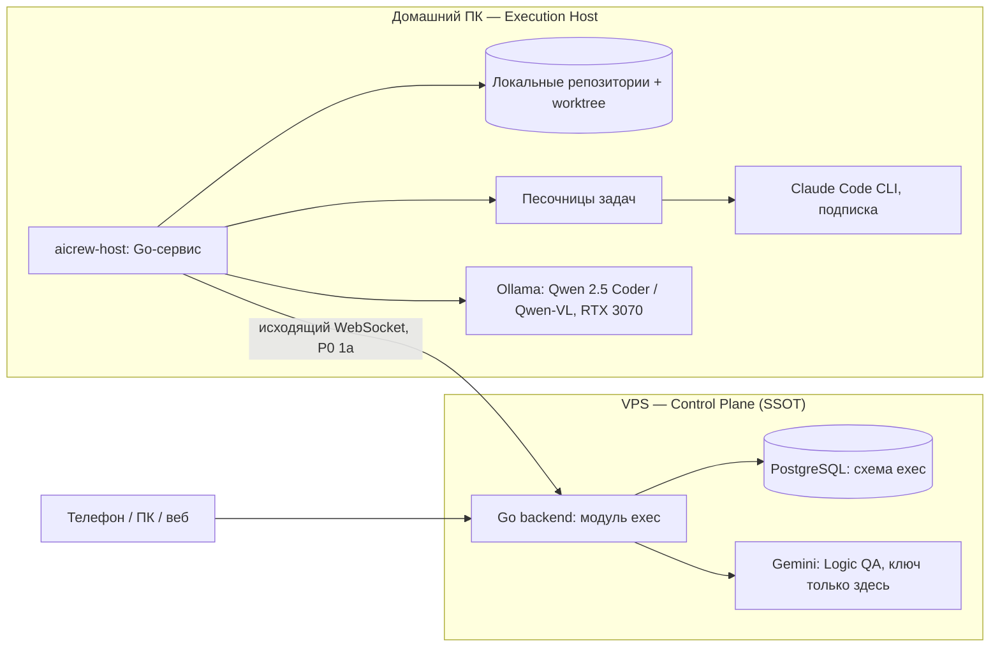

# Этап 7.1: архитектура AiCrew

Статус: **на согласовании**. Дата: 08.10.2026. Основа: ТЗ п. 7–15, [P0](P0-decisions.md).

AiCrew — Execution Plane: менеджер, оркестратор и агенты, которые выполняют AI Task из дерева PromptTree в локальных репозиториях на домашнем ПК. Этот документ фиксирует топологию, изоляцию и контракт запуска агентов. Детали state machine, merge-очереди и проверок — в документах 7.2–7.4.

## 1. Топология

- **Истина о задачах — только PostgreSQL на VPS** (ТЗ п. 7). Статусы меняет только сервер, проверяя допустимость перехода. Модели статус не выставляют.
- **aicrew-host** — один Go-бинарник на домашнем ПК, служба Windows. Сам подключается к VPS (входящих портов нет), берёт задачу с lease и heartbeat, готовит worktree, запускает агентов в песочнице, сам собирает машинные факты (diff, exit-коды, тесты) и отчитывается. Выключили ПК — lease истёк, задача вернулась в очередь (ТЗ п. 8.2).
- **Git только локальный**: worktree на задачу, слияние через очередь в integration-ветку, проверка после слияния, promote в main. Push в remote не делается (ТЗ п. 3, 13).
- **Ключ Gemini остаётся на VPS**: Logic QA вызывается через сервер, хост ключа не видит.

## 2. Изоляция на Windows — нужно ваше решение

Требование ТЗ п. 12: песочница — последняя линия защиты; агент не видит личных файлов, секретов и чужих репозиториев.

| Вариант | Изоляция | GUI / Roblox Studio | GPU, Ollama | Сборки |
|---|---|---|---|---|
| **A.** Отдельный пользователь Windows `ai_worker` | слабая: общее ядро и сеть, фильтр сети по пользователю в Windows почти невозможен | да | да | Windows, Android, веб |
| **B.** Отдельный дистрибутив WSL2 | средняя: свой Linux, но общий виртуальный адаптер и доступ к `/mnt/c` нужно отключать вручную | нет | Ollama на Windows доступна по localhost | Go, Flutter Linux/Android/веб |
| **C.** Docker-контейнер на задачу (Docker Desktop, WSL2) | **сильная**: одноразовый контейнер, смонтирован только worktree задачи, сеть только через allowlist-прокси, лимиты CPU и памяти | нет | Ollama остаётся на хосте, контейнер к ней не ходит | Go, Flutter Linux/Android/веб |

**Предложение: C по умолчанию + A позже, только для Roblox.**
- Код-задачи (Go, Flutter, веб) выполняются в одноразовом контейнере на задачу. Внутри Claude Code, toolchain проекта и worktree. Наружу открыты только Anthropic API, pub.dev, proxy.golang.org и npm — через прокси с allowlist. Всё прочее закрыто. Секретов в контейнере нет, кроме токена Claude Code на время запуска.
- Ollama (Junior, Vision QA) вызывает сам aicrew-host, а не контейнер: модели получают текст и скриншоты, доступа к ФС у них нет.
- Roblox Studio — Windows-приложение с GUI, в контейнер оно не помещается. Для профиля Roblox (этап 7.5) — отдельный пользователь Windows `ai_worker` без прав администратора, Studio и MCP-сервер Roblox. Vision QA там только по скриншотам (ТЗ п. 12).
- Сборки под Windows-десктоп в контейнере невозможны. Такие задачи проверяются сборкой Linux/веб, а сборка Windows делается вручную или после согласования.

## 3. Claude Code как исполнитель (блокер ТЗ п. 15)

Решение P0: подписка. Контракт запуска:

- **Авторизация**: `claude setup-token` один раз выпускает долгоживущий токен подписки. aicrew-host хранит его зашифрованным (Windows DPAPI) и передаёт в контейнер задачи переменной `CLAUDE_CODE_OAUTH_TOKEN` только на время запуска. В репозитории и логах его нет.
- **Запуск**: `claude -p <задача> --output-format stream-json --verbose --model <из конфига> --max-turns N --permission-mode acceptEdits --allowedTools <профиль роли> --disallowedTools <запреты> --mcp-config <MCP-профиль задачи> --strict-mcp-config`. Из stream-json берутся расход токенов, число вызовов и итог.
- **Ограничения ролей** задаются настройками Claude Code (`--allowedTools`, `--disallowedTools`) — это первый слой. Граница безопасности — контейнер (ТЗ п. 12): даже если агент выполнит что угодно, он не увидит ничего, кроме worktree, и не выйдет в сеть мимо allowlist.
- **Лимиты подписки общие с вашей ручной работой**, поэтому есть дневной лимит вызовов Claude и `budget_policy` по провайдеру (ТЗ п. 8.7). Исчерпание лимита — класс `RATE_LIMIT`: задача ждёт, а не падает.
- **Абстракция `AgentProvider`** (ClaudeCode / ClaudeAPI / Ollama / Gemini): если условия подписки или CLI изменятся, переключение на API-ключ — это замена провайдера в конфиге.
- Перед этапом 7.2 я проверю на вашем ПК, что `claude setup-token` и headless-запуск работают с вашей подпиской. Нужна установленная Claude Code CLI.

## 4. Роли и модели (ТЗ п. 10)

| Роль | Провайдер (по умолчанию, меняется в конфиге) | Где выполняется |
|---|---|---|
| Manager — декомпозиция в DAG, выбор скиллов и MCP-профиля | Claude Code, Haiku 5.5 | контейнер без worktree |
| Architect — `architecture.yaml` | Claude Code, самая сильная модель | контейнер |
| Tech Lead — сложные задачи, финальное ревью | Claude Code, Sonnet | контейнер с worktree |
| Junior — рутина, тесты, handoff | Ollama, Qwen 2.5 Coder 7B | aicrew-host |
| Logic QA | Gemini Flash | VPS |
| Vision QA | Ollama, Qwen-VL | aicrew-host, только скриншоты |

На RTX 3070 (8 ГБ) локальные модели загружаются по очереди: Ollama сама выгружает неактивную модель, aicrew-host запускает не больше одной локальной модели одновременно.

## 5. Данные (схема `exec`, детали — в 7.2)

`execution_hosts`, `workers`, `repositories` (локальный путь привязан к хосту), `exec_tasks` (связь с узлом PromptTree, статус, lease, бюджеты, `execution_mode`), `task_dependencies` (DAG), `attempts` (base/result commit, класс ошибки, расход), `approval_requests`, `skills`, `mcp_profiles`, `exec_audit`. Домен Execution не пишет в таблицы PromptTree: связь только по id узла (ТЗ п. 5.4).

## 6. Порядок реализации

| Этап | Что появляется | Как проверяется |
|---|---|---|
| 7.2 | state machine на сервере, aicrew-host, lease/heartbeat, один исполнитель (Claude Code) без слияния | убитый воркер, истёкший lease, атомарность CLAIMED |
| 7.3 | worktree, merge-очередь, integration-ветка, откат | конфликт слияния; A и B по отдельности проходят, вместе ломают main |
| 7.4 | профили проверок Go/Flutter/веб, `architecture.yaml`, Logic QA | красные тесты, нарушение контракта |
| 7.5 | Manager, DAG, скиллы, MCP-реестр, Junior на Qwen, профиль Roblox | выбор скиллов, MCP-scopes |
| 7.6 | секрет-сканер, Incident Kill Switch, аудит, канбан в приложении | утечка секрета, обход Command Policy |

Первый полезный результат — после 7.3: «AI Task из дерева → Claude Code в песочнице → тесты → слияние в integration-ветку».

## 7. Нужно ваше решение

1. **Изоляция**: Docker-контейнер на задачу (C), а для Roblox позже отдельный пользователь Windows (A)? Docker Desktop у вас установлен.
2. **Токен подписки** Claude Code хранится на домашнем ПК в зашифрованном виде и выдаётся контейнеру только на время задачи. Согласны?
3. **Первый репозиторий** для AiCrew: сам PromptTree (Go + Flutter) или другой проект?
4. **Параллельность**: сколько задач одновременно? Предлагаю одну: лимиты подписки и 8 ГБ видеопамяти.
